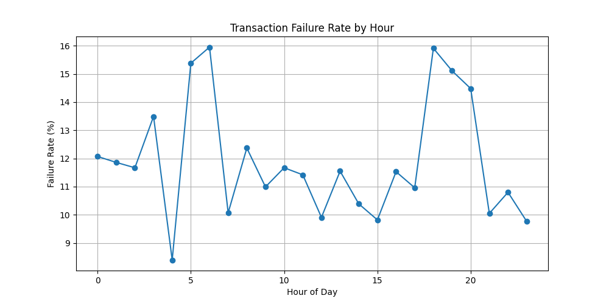
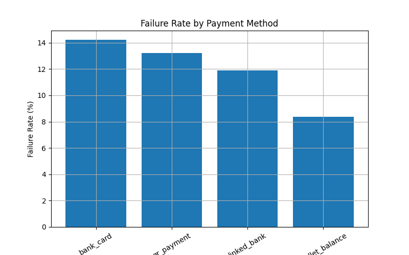

# 📊 Fintech Payment Reliability Analysis

## 📌 Project Overview

This project analyzes transaction failures in a digital wallet system to identify key reliability issues and propose data-driven improvements.

The goal is to:

* Improve transaction success rate
* Enhance user experience during payment
* Reduce potential revenue loss caused by failed transactions

---

## ❗ Problem Statement

Users experience a relatively high transaction failure rate (~12%), leading to:

* Frustration during payment
* Reduced trust in the platform
* Potential revenue loss due to abandoned transactions

This problem is not only technical but also related to system feedback and retry handling.

---

## 🧠 Approach

### 1. Business Analysis

* Defined problem and KPIs
* Mapped payment flow
* Identified pain points across:

  * UX (unclear status, poor messaging)
  * System (timeout, retry issues)
  * External dependencies (bank, gateway)

### 2. Data Analysis

* Designed data schema: `transactions`, `users`, `payments`
* Cleaned and explored dataset using SQL
* Built key metrics:

  * Failure Rate
  * Retry Rate
* Analyzed failure patterns:

  * By time
  * By payment method

### 3. Visualization

* Used Python (Pandas, Matplotlib) to visualize insights

---

## 📊 Key Metrics

* **Total Transactions:** ~19,566
* **Failure Rate:** ~12%
* **Retry Rate:** ~5–6%

👉 Indicates a significant reliability issue affecting both UX and business performance.

---

## ⏰ Failure Pattern by Time



**Insight:**

* Failure rate fluctuates (~8% → ~16%)
* Peaks at:

  * 05:00–06:00
  * 18:00–20:00

**Interpretation:**

* Higher system load during peak hours
* External system latency (bank/gateway) increases failure risk

---

## 💳 Failure by Payment Method



**Insight:**

* Bank card: highest failure (~14%)
* E-wallet: high (~13%)
* Linked bank: moderate (~12%)
* Wallet balance: lowest (~8%)

**Interpretation:**

* External-dependent methods are less reliable
* Internal balance-based transactions are more stable

---

## 🔍 Root Cause Analysis

Transaction failures are mainly driven by:

* **External system dependency**
  (bank delays, gateway instability)

* **Time-based load issues**
  (peak hours → higher failure)

* **Lack of structured retry mechanism**
  (low retry success rate)

* **Poor UX feedback**
  (no real-time status, unclear error messages)

---

## 🚀 Business Impact

* Reduced payment success rate
* Increased user frustration
* Potential revenue loss

---

## 💡 Recommendations

* Improve integration with bank APIs and payment gateways
* Implement smart retry mechanism for failed transactions
* Provide real-time transaction status to users
* Improve error messages with clear guidance
* Scale system capacity during peak hours

---

## 📂 Project Structure

```
payment-reliability-analysis/
├── dashboard/      # Charts
├── docs/           # Detailed analysis
├── mysql/          # SQL scripts
├── python/         # Visualization scripts
├── README.md
```

---

## 🛠️ Tools & Technologies

* SQL (MySQL)
* Python (Pandas, Matplotlib)
* GitHub

---

## 🧠 Final Conclusion

Transaction failures are not random — they are driven by system design limitations, external dependencies, and peak-hour load.

Improving reliability requires a combination of:

* System optimization
* Better UX design
* Smart retry strategies
  
---

## 👤 Author

Phạm Tiến Thành
Business Analyst / Data Analyst (Intern Level)
