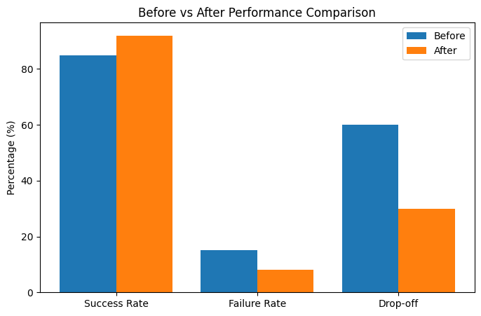
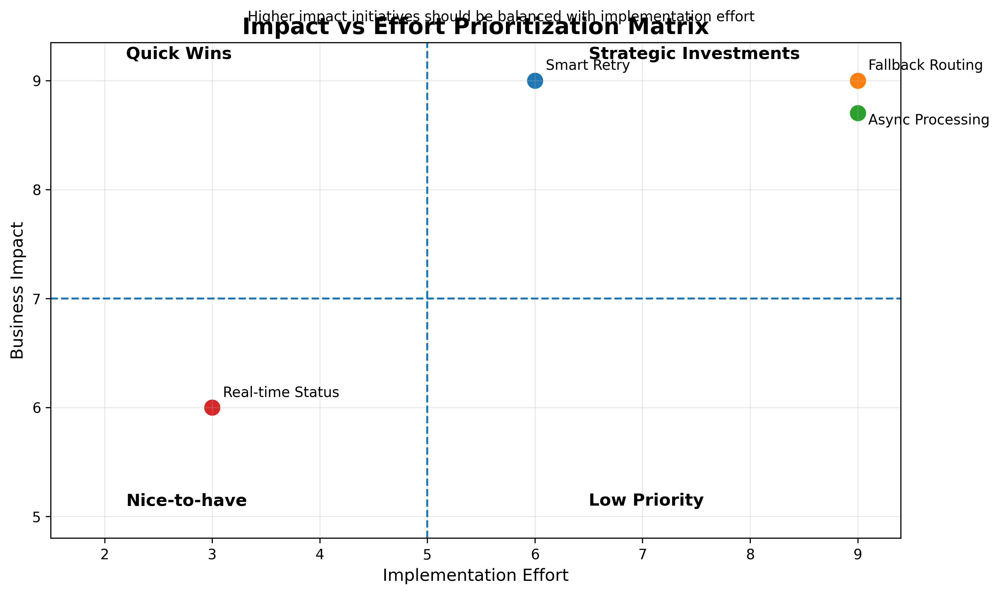

# 💳 Payment Reliability Analysis

## 📌 Overview

This project analyzes **transaction failures in a digital wallet system** using SQL and Python to identify patterns affecting payment reliability.

Focus:

* Data analysis (SQL)
* Pattern detection (time & payment method)
* Visualization (Python)
* Insight generation

---

## 📊 Dataset Summary

* Total transactions: **19,566**
* Users: ~3,000
* Payment methods: 12
* Failure rate: **~12%**

👉 Significantly higher than expected benchmark (≤2%)

---

## 🔍 Analysis Approach

Key questions:

1. When do failures occur?
2. Which payment methods are most affected?

---

## 📈 Failure Rate by Hour


### Insight

* Failure peaks at:

  * **05:00–06:00**
  * **18:00–20:00**

👉 Indicates:

* Peak-hour load pressure
* External system delays

---

## 💳 Failure Rate by Payment Method


### Insight

* **Bank / QR → higher failure**
* **Wallet balance → more stable**

👉 External dependency increases risk

---

## 🧠 Core Insight

Transaction failures are driven by:

* External systems (bank, gateway)
* Time-based load
* Lack of recovery mechanisms

👉 Not random → systemic issue

---

## 🚀 Solution Direction (High-Level)

To improve reliability:

* Introduce **smart retry mechanism**
* Handle **timeouts with async processing**
* Add **fallback routing**
* Improve **user feedback (status & error messages)**

👉 Focus: convert failures → recoverable transactions

---

## 📊 Expected Impact



### Estimated Improvements

* Success rate: **85% → 92%**
* Failure rate: **15% → 8%**
* Drop-off: **60% → 30%**

👉 Biggest gain comes from:

* Recovering failed transactions (retry)
* Reducing user abandonment

---

## ⚖️ Solution Prioritization



### Insight

* **Quick wins:** UX improvements (error message, retry guidance)
* **Strategic:** retry system, async processing

👉 Balance between:

* Short-term impact
* Long-term system reliability

---

## 🛠️ Tech Stack

* SQL (MySQL)
* Python (Pandas, Matplotlib)

---

## 📂 Project Structure

```bash id="g3hz2r"
payment-reliability-analysis/
│
├── mysql/        # SQL queries
├── python/       # Python scripts
├── dashboard/    # charts
└── README.md
```

---

## ▶️ How to Run

```sql id="rrwh5t"
create_tables.sql
explore_data.sql
clean_data.sql
kpi_failure_rate.sql
failure_by_time.sql
failure_by_method.sql
```

```bash id="y4rj3l"
python failure_rate_by_hour.py
python failure_rate_by_method.py
```

---

## 📌 What This Project Shows

* SQL-based data analysis
* Pattern detection from real-world data
* Visualization using Python
* Understanding of system reliability in fintech

---

